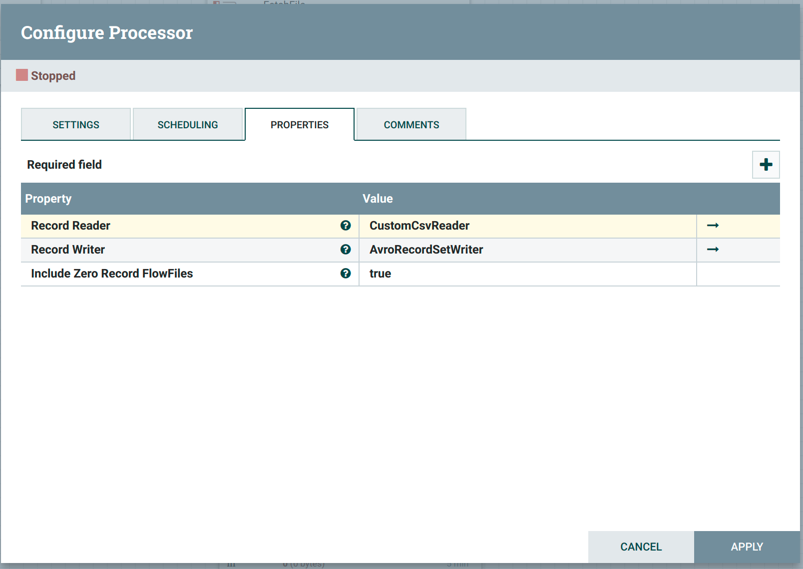
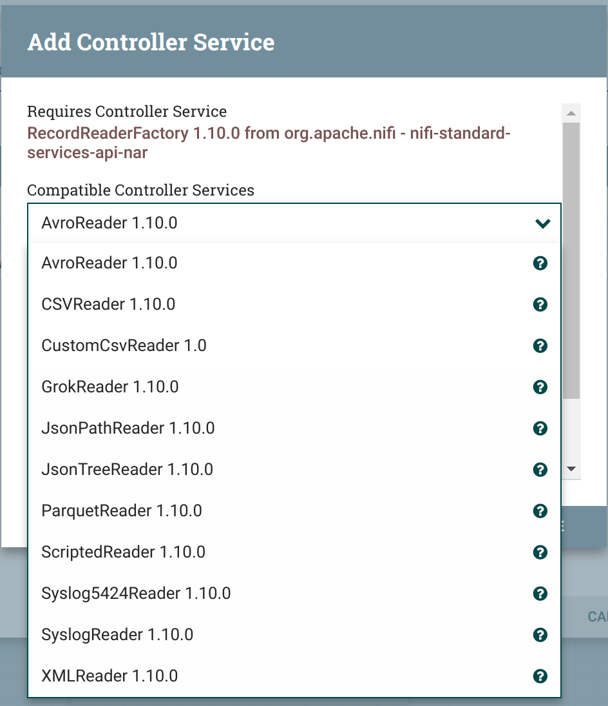
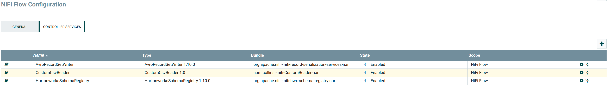
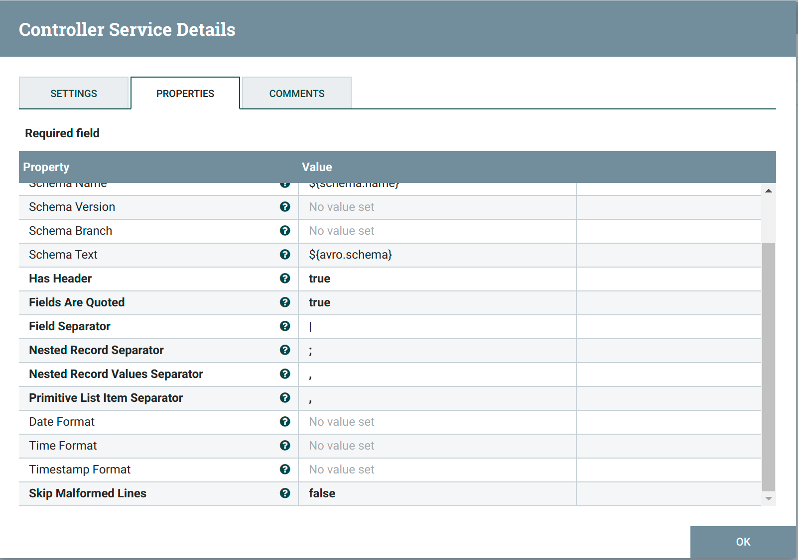

# Introduction 

This nifi custom csv reader processes non-standard csv fields with nested values that is currently not supported by
the standard nifi csv reader.
It also provides hashing capability for sensitive data through schema configuration.
The reader contains all the capabilities already contained in the standard csv reader.

###  Getting Started

The project requires JDK8 and maven 3 to compile.

### Build and Test

execute `mvn clean install` inside the root directory

### Nifi deploy

copy the `nifi-CustomReader-nar-1.0.nar` and `nifi-CustomReader-api-nar-1.0.nar` into nifi lib directory and restart 
apache nifi

### how to
After you have started your apache nifi successfully you can access the custom reader through controller services. The following images can help you setup  

Above image shows nifi convert record processor with reader and write configurations. click on record reader and select create new service and chose CustomCsvReader as shown in t
image below:

after select the custom reader in order to go to the configurations window associated to it as shown below:

click on the configurations icon to configure various options provided by the reader including `field separator` , `nested record separator` , `nested record values separator` among other configurations as shown below

